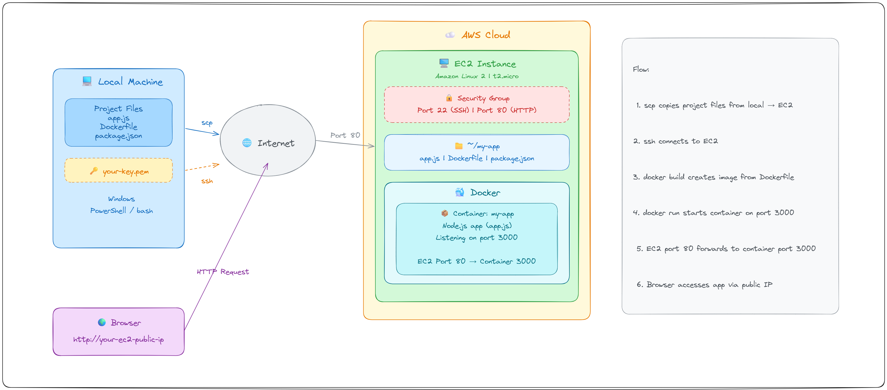

# Dockerized Node.js Deployment on AWS EC2

## Architecture Diagram



## What are we doing here?

We built a small web application, packed it into a Docker container, shipped it to a cloud computer (EC2 on AWS), and made it accessible to anyone on the internet via a browser.

That's it. No complicated setup on every machine, no "it works on my computer" problems.

---

## What is Docker?

Imagine you made a sandwich at home and it tasted perfect. But when you try to make the same sandwich at a friend's house, it tastes different because they have different bread, different butter, different everything.

Docker solves this problem for software.

Docker lets you pack your application along with everything it needs (the code, the libraries, the settings) into a single box called a **container**. That container runs the same way everywhere — on your laptop, on a server, on the cloud. No surprises.

### Without Docker:
- You write code on your machine
- It works fine locally
- You put it on a server
- It breaks because the server has a different version of Node.js, or a missing library, or different settings
- You spend hours debugging

### With Docker:
- You pack everything into a container
- The container runs the same way on every machine
- No more "it works on my machine" excuses

---

## What is EC2?

EC2 (Elastic Compute Cloud) is basically a computer in Amazon's data center that you can rent by the hour. Instead of buying a physical server, you just spin one up on AWS, use it, and pay only for what you use.

Think of it like renting a hotel room instead of buying a house. You get a fully functional computer without owning any hardware.

---

## What is a Dockerfile?

A Dockerfile is like a recipe. It tells Docker step by step how to build your container.

```
FROM node:18-alpine       → Start with a machine that has Node.js installed
WORKDIR /app              → Go to the /app folder
COPY package*.json ./     → Copy the ingredient list (dependencies)
RUN npm install           → Install those ingredients
COPY . .                  → Copy all your code
EXPOSE 3000               → The app will be available on port 3000
CMD ["npm", "start"]      → Start the app
```

Docker reads this file and builds a container image — a ready-to-run snapshot of your app.

---

## What are Ports? (The Hotel Room Analogy)

Think of your EC2 server like a big hotel. The hotel has one address (the public IP), but many rooms inside (ports). Each room handles a different type of visitor.

- Room 22 → SSH (for you to connect and manage the server)
- Room 80 → HTTP (for visitors coming from a browser)
- Room 3000 → Where your Node.js app is actually running inside Docker

When we ran the container with:
```bash
docker run -p 80:3000 my-docker-app
```

We told Docker: "Anyone who knocks on the hotel's front door (port 80) should be sent to room 3000 inside the container."

```
Browser → http://your-ec2-ip (port 80)
              ↓
         EC2 receives request on port 80
              ↓
         Docker forwards it to port 3000 inside the container
              ↓
         Your Node.js app responds
```

That's why `curl http://localhost` works but `curl http://localhost:3000` doesn't — port 3000 is only open inside the container, not on the EC2 machine itself.

---

## Why not just run the app directly without Docker?

You could. But then you'd have to:
- Install Node.js on every server manually
- Make sure the version matches
- Handle environment differences
- Redo all of this every time you deploy to a new server

With Docker, you do it once, pack it up, and ship it anywhere.

---

## The Full Picture — What We Did Step by Step

```
1. Wrote a simple Node.js web app (app.js)
        ↓
2. Wrote a Dockerfile (the recipe to build the container)
        ↓
3. Launched an EC2 instance on AWS (rented a cloud computer)
        ↓
4. Copied our project files from local machine to EC2
        ↓
5. Built the Docker image on EC2 (cooked the recipe)
        ↓
6. Ran the container on EC2 (served the dish)
        ↓
7. Opened port 80 in security group (unlocked the front door)
        ↓
8. Accessed the app from browser using EC2's public IP
```

---

## Quick Reference

| Term | Simple Meaning |
|------|---------------|
| Docker | A tool to pack and run apps in containers |
| Container | A box with your app and everything it needs |
| Image | The blueprint/recipe for a container |
| Dockerfile | Instructions to build the image |
| EC2 | A rented computer on AWS cloud |
| Port | A door number on your server |
| Port 80 | The standard front door for websites |
| Port 3000 | Where Node.js app runs inside the container |
| -p 80:3000 | Forward traffic from door 80 to door 3000 inside container |
| Security Group | Firewall rules — which doors are open to the public |

---

## Test Your App

Once deployed, open your browser and go to:
```
http://your-ec2-public-ip
```

You should see:
```json
{"message": "Hello from Docker on EC2!", "timestamp": "..."}
```

That response is coming from your Node.js app, running inside a Docker container, on a cloud computer in Amazon's data center. Pretty cool.


---

## How is the app accessible globally?

The internet is just computers talking to each other using IP addresses.

When AWS launched your EC2 instance, it assigned a public IP — something like `your-ec2-public-ip`. This IP is registered on the global internet, meaning any computer anywhere in the world can send a request to it.

```
Your Browser (anywhere in the world)
        ↓
  types http://your-ec2-public-ip
        ↓
  Request travels through the internet
        ↓
  Reaches Amazon's data center
        ↓
  Hits your EC2 machine on port 80
        ↓
  Docker forwards it to your Node.js app on port 3000
        ↓
  App sends back the JSON response
        ↓
  You see it in the browser
```

### Why can anyone access it?

Two things make this work:

1. **Public IP** — AWS gave your EC2 a globally routable IP, not a private one like `192.168.x.x` which only works inside a local network.

2. **Security group allows port 80** — You opened the door. If port 80 was blocked, the request would be dropped before even reaching Docker.

### Public IP vs Private IP

| Type | Example | Who can reach it |
|------|---------|-----------------|
| Private IP | 172.31.17.55 | Only machines inside AWS network |
| Public IP | your-ec2-public-ip | Anyone on the internet |

When you SSH into EC2, the terminal shows `ip-172-31-17-55` — that's the private IP inside AWS. But the outside world reaches your app via the public IP.

### One catch — the IP is temporary

The public IP is dynamic. If you stop and restart your EC2 instance, AWS assigns a different IP and your old link stops working.

To keep a permanent IP, use an **Elastic IP** in AWS — a static IP that stays the same no matter how many times you restart the instance.

- AWS Console > EC2 > Elastic IPs > Allocate > Associate to your instance


---

## The Dockerfile — Line by Line

A Dockerfile is a set of instructions Docker follows to build your app's container. Think of it like a shopping list + c`ooking instructions combined. Docker reads it top to bottom and builds your container step by step.

Here's our Dockerfile explained:

```dockerfile
FROM node:18-alpine
```
"Start with a base machine that already has Node.js version 18 installed."
Alpine is a tiny lightweight version of Linux — keeps the container small and fast.
You're not starting from scratch. You're standing on the shoulders of an already prepared environment.

```dockerfile
WORKDIR /app
```
"Inside the container, go to the /app folder. Create it if it doesn't exist."
All the following commands will run from this folder. Like doing `cd /app`.

```dockerfile
COPY package*.json ./
```
"Copy package.json and package-lock.json from your local machine into the container's /app folder."
These files list all the libraries your app needs. We copy them first before the actual code — this is a performance trick (explained below).

```dockerfile
RUN npm install --production
```
"Install all the dependencies listed in package.json."
This downloads Express and any other libraries your app needs, directly inside the container.

Why copy package.json first and install before copying the rest of the code?
Docker caches each step. If your code changes but package.json didn't, Docker skips the npm install step and reuses the cached layer. Faster builds.

```dockerfile
COPY . .
```
"Now copy everything else — your app.js, and all other project files — into the container."
The `.dockerignore` file makes sure `node_modules` and other junk don't get copied over.

```dockerfile
EXPOSE 3000
```
"This container will listen on port 3000."
This is just documentation — it tells Docker and anyone reading the file that the app runs on port 3000. It doesn't actually open any port by itself.

```dockerfile
RUN addgroup -g 1001 -S nodejs
RUN adduser -S nodejs -u 1001
USER nodejs
```
"Create a user called nodejs and switch to that user."
By default Docker runs as root (admin), which is a security risk. We create a non-root user so even if someone hacks into the container, they don't have full system access.

```dockerfile
CMD ["npm", "start"]
```
"When the container starts, run npm start."
This is the final command that actually launches your Node.js app inside the container.

---

## How Files Are Copied from Local Machine to EC2

Your local machine and EC2 are two completely separate computers. To get your files from one to the other, we use a tool called **SCP** (Secure Copy Protocol). It works over SSH — the same secure tunnel you use to connect to EC2.

```
Your Local Machine (Windows)
D:\workspace\Projects\Day-8-Docker-EC2\
        │
        │  scp -i "your-key.pem" -r . ec2-user@your-ec2-public-ip:~/my-app
        │
        │  What this means:
        │  -i "your-key.pem"  → use this key to authenticate (like a password)
        │  -r                 → copy recursively (all files and subfolders)
        │  .                  → copy everything in the current folder
        │  ec2-user@...       → connect as ec2-user on this IP
        │  :~/my-app          → put it in the my-app folder on EC2
        ↓
EC2 Instance (Amazon Linux)
~/my-app/
  ├── app.js
  ├── package.json
  ├── Dockerfile
  ├── .dockerignore
  └── deploy-to-ec2.sh
```

The `.pem` file is your private key — it proves to EC2 that you are who you say you are. Without it, EC2 refuses the connection. That's why the full path to the key matters — if it can't find the file, it can't authenticate.

---

## How Docker is Built and Run on EC2

Once the files are on EC2, here's exactly what happens step by step:

### Step 1: You SSH into EC2
```bash
ssh -i "your-key.pem" ec2-user@your-ec2-public-ip
```
You're now inside the EC2 machine, typing commands directly on it.

### Step 2: Navigate to the app folder
```bash
cd ~/my-app
```
This is where all your files were copied to.

### Step 3: Build the Docker image
```bash
docker build -t my-docker-app .
```

What happens here:
```
docker build          → tell Docker to build an image
-t my-docker-app      → name/tag the image "my-docker-app"
.                     → look for the Dockerfile in the current folder

Docker then:
  1. Reads the Dockerfile line by line
  2. Pulls node:18-alpine from the internet (first time only)
  3. Creates a /app folder inside the image
  4. Copies package.json into it
  5. Runs npm install inside it
  6. Copies all your code into it
  7. Sets up the non-root user
  8. Saves all of this as an image called "my-docker-app"
```

The image is like a frozen snapshot of your app — fully set up and ready to run.

### Step 4: Run the container
```bash
docker run -d --name my-app -p 80:3000 --restart unless-stopped my-docker-app
```

Breaking this down:
```
docker run              → create and start a container from an image
-d                      → run in background (detached), don't block the terminal
--name my-app           → give the container a name so you can refer to it easily
-p 80:3000              → map port 80 on EC2 to port 3000 inside the container
--restart unless-stopped → automatically restart if it crashes or EC2 reboots
my-docker-app           → use this image to create the container
```

What happens after this command:
```
EC2 starts the container
        ↓
Container boots up with Node.js already installed
        ↓
Runs "npm start" (from CMD in Dockerfile)
        ↓
Node.js app starts listening on port 3000 inside the container
        ↓
EC2 listens on port 80 and forwards traffic to container's port 3000
        ↓
App is live and accessible at http://your-ec2-public-ip
```

### The difference between an Image and a Container

| Image | Container |
|-------|-----------|
| A blueprint / frozen snapshot | A running instance of that blueprint |
| Like a cake recipe | Like the actual cake |
| Stored on disk | Running in memory |
| Built with `docker build` | Started with `docker run` |
| Can create many containers from one image | Each container is independent |
